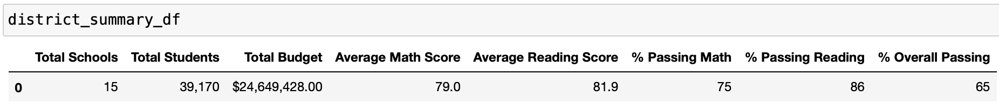
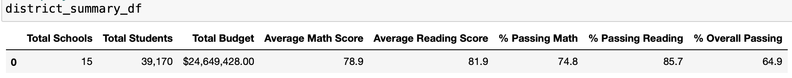

# School District Analysis

## Overview of the school district analysis.

The purpose of this project was to take out the reading and math scores of Thomas High School's ninth-graders due to academic dishonesty. After doing so, we had to repeat the school district analysis and see how these changes affected it. 

## Results.

1. How is the district summary affected?

The district analysis was barely affected. As we can see in the images below, the math score was only altered by 0.1. And the reading score remains the same.  The passing percentage of math and reading was affected by 0.2% and 0.3% respectively. And the overall passing percentage was only affected by 0.1%.

This is because of the size of the data set, given that is so large, when we take out such small data as we did,  results are not severely affected.

2. How is the school summary affected?

The School summary was affected only in the Thomas High School metrics.

The average scores and the percentage of passing students were affected but in a very small amount like it was on the district summary.

3. How does replacing the ninth graders’ math and reading scores affect Thomas High School’s performance relative to the other schools?

Thomas High School's performance relative to the other schools wasn't affected at all. Even with the 9th graders' data removed, it kept its second place on the ranking.

4. How does replacing the ninth graders’ math and reading scores affect math and reading scores by grade.

The only place where this is affected is in the Thomas High School, 9th-grade intersection, where there is no information. Everything else stayed the same.

5. How does replacing the ninth graders’ math and reading scores affect scores by school spending.

There was no significant alteration.

6. How does replacing the ninth graders’ math and reading scores affect scores by school size

There was no significant alteration.

7. How does replacing the ninth graders’ math and reading scores affect scores by school type

There was no significant alteration.

## Summary. 

The changes that occured in the analysis after removing the Thomas High School 9th grade date were.

1. He had to get a new number of total students by substracting the students  in ninth grade at Thomas High School from the total student count.

2. With the new student count, the district summary's passing math, passing reading, and overall passing percentage, changed.

3. When calculating Thomas High School metrics, we had to get the number of students from 10th grade to 12th grade and use that as its total number of students.

4. With the new Thomas High School Student count, its average math scores, average reading scores,  passing math percentage, passing reading percentage, and overall percentage changed.

Even though these changes occur, they weren't significant at all. So we can conclude that removing the 9th-grade data didn't affect our analysis.

